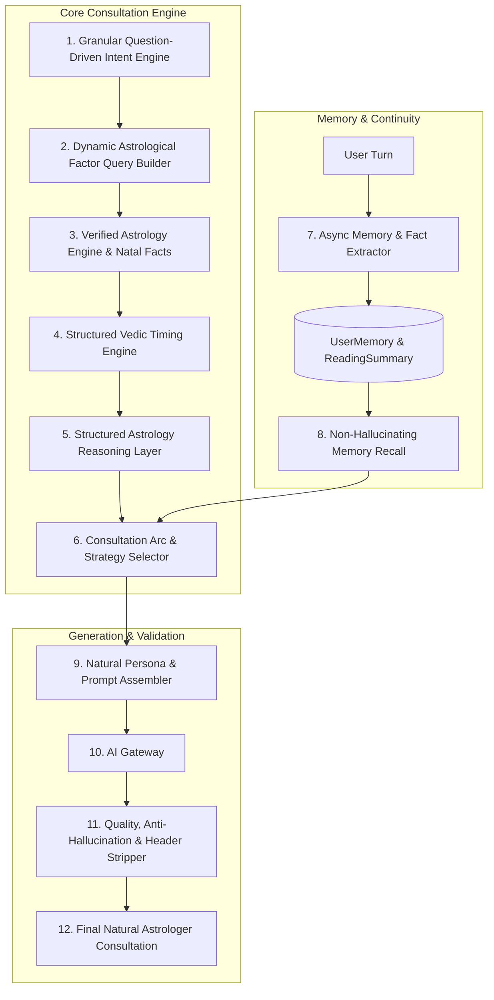

# AstroAI Platform — Astrologer Behavior & Consultation Intelligence Audit

**Date**: September 2026  
**Module Audited**: `backend/src/modules/astrologer-intelligence/`, `backend/src/modules/chat/`, `backend/src/modules/astrology/`, `backend/src/modules/ai/`  
**Standard**: `CLAUDE.md` & Vedic Astrologer Consultation Specification  

---

## 1. Executive Summary & Current Behavior

The initial implementation of `backend/src/modules/astrologer-intelligence/` established the structural domain boundary, separating intent detection, emotional analysis, consultation state transitions, selective context retrieval, reasoning, prompt assembly, and output safety.

### Current Pipeline:
```text
User Message 
  ➔ detectLanguage 
  ➔ intentEngine.detectIntents + emotionDetector.detectEmotion 
  ➔ Crisis Safety Gate 
  ➔ consultationStateMachine.resolveNextState 
  ➔ responseStrategyEngine.determineStrategy 
  ➔ contextBuilder.buildAstrologyContext + memoryService.getRelevantMemory + personaManager.getActivePersona 
  ➔ astrologyReasoningEngine.reason 
  ➔ promptAssembler.buildSystemPrompt 
  ➔ AI Gateway (SMART_CHAT / FAST_CHAT) 
  ➔ responseQualityValidator.validate 
  ➔ async reading summary persistence 
  ➔ JSON Response to Mobile/Web Client
```

While technically modular and passing automated baseline tests (54/54 files, 383/383 tests), deep inspection reveals that **behaviorally, the system still exhibits significant chatbot patterns** instead of feeling like an authentic Vedic Pandit (*Acharya Vashishta*) conducting an ongoing, personalized consultation.

---

## 2. Current Weaknesses

1. **Static / Hardcoded Astrology Reasoning**:
   - `astrologyReasoningEngine.ts` contains hardcoded strings (e.g. for marriage: `"Age 25 to 28"`, `"7th House (Kalatra Bhava)"`, `"Guru (Jupiter) & Shukra (Venus) Alignment"`).
   - It does **not** dynamically inspect the user's actual natal chart to extract the true 7th lord, planets placed in the 7th house, aspects on the 7th house, or calculate dynamic timing windows based on the user's birth date and actual Mahadasha/Antardasha dates.
   - If a 42-year-old user asks about marriage, the static reasoning engine still emits "Age 25 to 28".
2. **Coarse Question-to-Factor Topic Mapping**:
   - `topicMappings.ts` only supports 5 coarse buckets: `MARRIAGE`, `CAREER`, `FINANCE`, `RELATIONSHIP`, `GENERAL`.
   - Compound questions (e.g. *"Shaadi ke baad career pe kya impact hoga?"*) lose cross-domain depth (7th house + 10th house interaction).
   - Important life areas (Education/9th house, Higher studies/Abroad/12th house, Property/Vehicles/4th house, Health/6th/8th house, Parents/4th/9th house) collapse into `GENERAL` or `CAREER`.
3. **Passive Memory Architecture (No Automated Memory Extraction)**:
   - `UserMemoryModel` and `ReadingSummaryModel` schemas exist in MongoDB, but **no memory extractor runs on conversation turns** to automatically extract user facts (e.g. *"I am an iOS developer"*, *"I have 2 kids"*, *"Preparing for UPSC"*).
   - As a result, cross-session memory remains empty unless manually injected.
4. **Lack of Memory Recall Handling**:
   - When a user asks *"Remember that job change we talked about?"*, the system does not verify whether memory exists; if missing, it risks LLM hallucination rather than an honest Acharya statement: *"I don't have that part of our earlier conversation available right now."*
5. **Rigid Consultation Arc**:
   - The state machine lacks dynamic awareness between *simple single-turn factual questions* (e.g. *"Aaj ka lucky colour kya hai?"*, which need direct short answers) and *complex life dilemmas* (e.g. *"Should I leave my job and start a startup?"*, which need clarifying questions).

---

## 3. Where Chatbot Behavior Still Exists

| Chatbot Characteristic Observed | Desired Vedic Astrologer Behavior |
|---|---|
| **Single-turn answer dumping**: Immediately produces a full report for every message regardless of context. | **Consultation dialogue**: Clarifies ambiguous goals, asks about current circumstances, and examines chart factors tailored to the exact problem. |
| **Generic template tone**: Starts messages with boilerplate phrases like *"Based on Vedic astrology principles..."* or *"According to your chart..."*. | **Warm Acharya persona**: Speaks directly and conversationally (*"Pranam! Aapki kundli me 10th house me Surya aur Shani ki sthiti dekh raha hoon..."*). |
| **Static timing claims**: Utters fixed age brackets or dates detached from actual dasha cycles. | **Dynamic timing windows**: Formulates structured timing windows (`windowStart`, `windowEnd`, `strength`, `relevantFactors`, `confidence`) grounded in current Dasha + transit periods. |
| **Disjointed conversations**: Treats every session as if meeting the user for the first time. | **Continuity & memory**: Remembers previous consultations, ongoing life projects, and references past guidance naturally. |
| **Forced astrology on non-astrological queries**: Answers practical questions (e.g. *"How do I prepare for my interview?"*) with forced planetary remedies. | **Balanced guidance**: Offers practical real-world advice combined with supportive planetary periods when relevant. |

---

## 4. Missing Consultation Behavior

1. **Question-Driven Consultation Strategy**:
   - The system must classify whether a query warrants:
     - `ANSWER_DIRECTLY`: Fast, direct, concise answer for simple/daily questions.
     - `ASK_CLARIFICATION`: Context-seeking question when user query is broad or ambiguous.
     - `EMPATHY_THEN_READING`: Emotional distress acknowledgment before chart analysis.
     - `DEEP_CONSULTATION`: Comprehensive chart synthesis for major life decisions.
2. **Consultation Arc State Progression**:
   - `OPENING` ➔ `UNDERSTANDING` ➔ `COLLECTING_CONTEXT` ➔ `CHART_ANALYSIS` ➔ `INTERPRETATION` ➔ `EXPLANATION` ➔ `FOLLOW_UP` ➔ `DEEPER_EXPLORATION`.

---

## 5. Missing Astrology Grounding & Timing Engine

1. **Strict Triad Separation**:
   - **FACT**: Exact planet positions, house lords, nakshatras, current dasha, transits retrieved from Astrology Engine.
   - **INTERPRETATION**: Astrological reasoning layer synthesizing supportive/challenging factors, karaka placements, house lord alignments, and dasha-transit synchronicity.
   - **EXPLANATION**: LLM generating natural, conversational dialogue without inventing facts.
2. **True Dynamic Timing Engine**:
   - Must calculate timing windows dynamically using:
     - User's actual age computed from `dateOfBirth`.
     - Current Mahadasha planet and Antardasha start/end ISO dates.
     - Benefic/malefic transit activations over key houses (7th for marriage, 10th for career, 2nd/11th for wealth, 9th/12th for travel/education).
     - Confidence rating adjusted by `timeConfidence` (`exact`, `approximate`, `unknown`).

---

## 6. Missing Follow-Up Intelligence

- **Contextual Exploration Chips**:
  - Rather than static chips, follow-up chips must dynamically adapt to the exact sub-topic (e.g. for Career confusion: *Current role growth*, *Job switch timing*, *Business venture yogas*, *Next 6 months*).
- **Proactive Next Steps**:
  - Concluding a reading by naturally offering the next logical avenue to explore without robotic prompts (*"Would you like to know more?"*).

---

## 7. Missing Memory & Continuity Behavior

1. **Automated Fact Extraction**:
   - After each consultation turn, an asynchronous lightweight extractor must extract persistent user context (career role, relationship status, life goals, challenges) into `UserMemory`.
2. **Contextual Reading Continuity**:
   - When user refers to earlier discussions (*"Remember that job change we talked about?"*), query `ReadingSummaryModel` and `UserMemoryModel`. If found, reference previous findings. If not found, explicitly state: *"I don't have that part of our earlier conversation available right now."* (Strict anti-hallucination rule).

---

## 8. Missing Emotional & Language Behavior

1. **Emotional Response Sequence**:
   - `ACKNOWLEDGE` ➔ `REASSURE (NO FALSE PROMISES)` ➔ `ASTROLOGICAL PERSPECTIVE` ➔ `PRACTICAL GUIDANCE` ➔ `OPTIONAL FOLLOW-UP`.
2. **Multilingual Consistency**:
   - Equal reasoning and timing depth across English, Hindi (Devanagari), and Hinglish (Roman script), with instant in-flight language switching on demand (*"Hinglish mein batao"* ➔ *"Now explain in English"*).
3. **Dynamic Response Length**:
   - Short (60–120 words) for simple queries, Medium (150–250 words) for standard readings, Detailed (250–380 words) for complex consultations. No 800-word walls of text.

---

## 9. Voice Consultation & Shared State

- The voice turn pipeline (`voiceSession.service.ts`) must route through the exact same `executeAstrologerConsultation` intelligence, state machine, and memory layer as chat, ensuring seamless text-to-voice continuity.

---

## 10. Recommended Changes & Implementation Blueprint



### Required Deliverables:
1. `docs/ASTROLOGER_BEHAVIOR_AUDIT.md` (Created)
2. `docs/ASTROLOGER_BEHAVIOR_SPEC.md` (Specification of consultation states, factor mappings, timing rules, and rubric)
3. `docs/ASTROLOGER_GOLDEN_CONVERSATIONS.md` (Comprehensive benchmark transcripts across 10 core life scenarios)
4. Comprehensive Behavior Evaluation Test Suite in `backend/tests/unit/astrologer-intelligence/behavior/` with automated Rubric Scoring (Target: >= 4.0/5.0).
