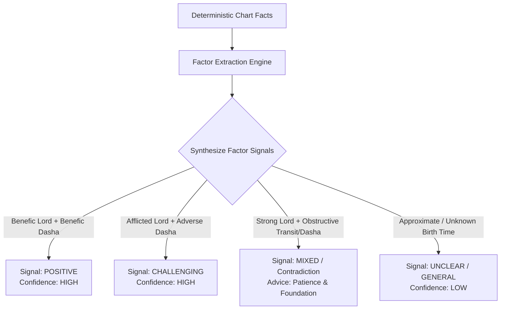

# Astrologer Reasoning Specification (Layer 2)

**Document Version:** 1.0.0  
**Core Responsibility:** Synthesize deterministic Vedic chart facts into structured multi-factor interpretations before language generation.

---

## 1. Core Principle: Multi-Factor Synthesis

Real Vedic astrology never relies on a single placement (e.g. *"Saturn in 10th means career delay"*). Real analysis requires synthesizing:
1. **House & House Lord Status** (Bhava & Bhavesha strength, placement, aspects).
2. **Natural & Functional Karakas** (e.g., Sun/Saturn for Career, Venus/Jupiter for Marriage).
3. **Planetary Dignity & State** (Exalted, Debilitated, Retrograde, Combust, Friendly sign).
4. **Vedic Drishti (Aspects)** (Full 7th aspect, special aspects of Mars, Jupiter, Saturn).
5. **Active Dasha Period** (Mahadasha, Antardasha planetary rulerships and nature).
6. **Active Transits (Gochar)** (Jupiter expansion, Saturn discipline / Sade Sati, Rahu-Ketu nodal shift).
7. **Contradictions & Tension Resolution** (e.g., Exalted 10th Lord under an adverse Dasha).

---

## 2. Structured Interpretation Schema

```typescript
export interface AstrologicalFactor {
  factor: string; // e.g. "10th Lord Sun in Aries (Exalted)"
  category: 'HOUSE' | 'PLANET' | 'DASHA' | 'TRANSIT' | 'YOGA';
  influence: 'SUPPORTIVE' | 'CHALLENGING' | 'NEUTRAL';
  weight: number; // 1 to 5
  description: string;
}

export interface AstrologicalInterpretation {
  topic: string; // e.g. "CAREER", "MARRIAGE", "FINANCE"
  supportingFactors: AstrologicalFactor[];
  challengingFactors: AstrologicalFactor[];
  timingFactors: AstrologicalFactor[];
  contradictions: AstrologicalFactor[];
  overallSignal: 'positive' | 'mixed' | 'challenging' | 'unclear';
  confidence: 'high' | 'medium' | 'low';
  timingWindows: TimingWindow[];
  remedies: string[];
  uncertaintyNotes: string[];
  methodologyVersion: string;
  ruleVersion: string;
  astrologyEngineVersion: string;
  userFacingExplanationSummary: string;
}
```

---

## 3. Contradiction Resolution Logic



When contradictions occur:
* **The AI Astrologer explains the tension naturally**: *"Aapki chart me core career potential kaafi strong hai (10th house strength), lekin current Dasha phase patience aur skill-building maang raha hai."*
* Never presents conflicting factors as an absolute binary outcome.
