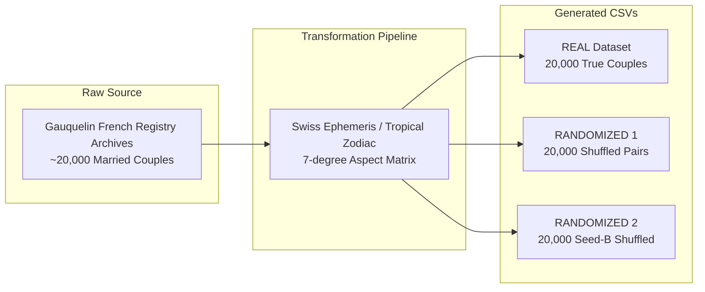
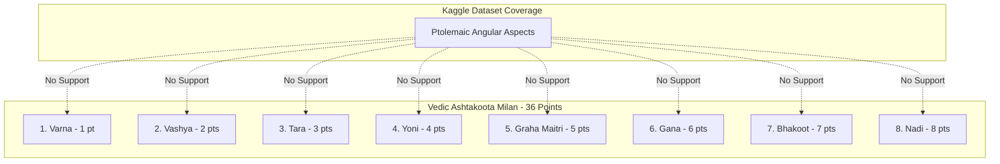

# Open Astrology Dataset Audit & Evaluation Report

**Document Version:** 1.0.0  
**Target System:** Astro AI (Vedic Astrology Platform & Acharya Vashishta Persona)  
**Dataset Source:** Kaggle `gokhanyu/open-astrology-datasets`  
**Primary Archive Files Evaluated:**
* `gauq-couples-aspects-REAL-7deg-20000-noa2b-cdata4.csv`
* `gauq-couples-aspects-RANDOMIZED-7deg-20000-noa2b-cdata4.csv`
* `gauq-couples-aspects-RANDOMIZED2-7deg-20000-noa2b-cdata4.csv`

---

## Executive Summary

This audit evaluates the open-source dataset `gokhanyu/open-astrology-datasets` for potential integration into **Astro AI**. 

### Primary Findings:
1. **Astrological Tradition**: The dataset is **100% Western / Tropical Synastry** based on Ptolemaic angular aspects (Conjunction, Opposition, Trine, Square, Sextile) with a uniform 7-degree orb.
2. **Vedic Compatibility**: The dataset **does NOT contain** Vedic astrology parameters (no Nakshatras, no Ashtakoota Guna Milan, no Navamsa D9 charts, no Vimshottari Dashas, no Vedic full-sign *Drishti*, and no Manglik Dosha).
3. **Data Provenance**: Derived from the historical Michel & Françoise Gauquelin archives of French civil marriage registries (1950s–1980s).
4. **License**: Released on Kaggle under **GPL-2.0** (strong copyleft).
5. **Architectural Role**: **REFERENCE_DATA / SYNTHETIC EVALUATION BENCHMARK ONLY**. It must **NEVER** replace deterministic Vedic calculations, be dumped into LLM prompts, or be used to train/fine-tune conversational models.

---

## 1. Dataset Overview

The dataset was compiled by researcher Gökhan Yu to study whether machine learning models can classify married couples versus randomly paired individuals using inter-chart astrological aspects.



---

## 2. File-by-File Analysis

### 1. `gauq-couples-aspects-REAL-7deg-20000-noa2b-cdata4.csv`
* **Purpose**: Positive class dataset representing 20,000 real historical married couples with pre-calculated inter-chart aspects.
* **Row Count**: 20,000 rows.
* **Column Count**: 412 columns.
* **Structure**:
  * Identifier and birth metadata columns (`Chart_A_Name`, `Chart_A_UTC`, `Chart_A_LatLong`, `Chart_B_Name`, `Chart_B_UTC`, `Chart_B_LatLong`).
  * 400+ binary aspect indicators (`A-B-SunCnjVen`, `A-B-MarOppVen`, `A-B-MerTriJup`, etc.).
* **Usefulness**: Serves as a baseline benchmark for cross-chart synastry aspect frequency studies.
* **Problems**: Purely Western/Tropical; ignores Vedic Nakshatra lords, house placements, and divisional charts.

### 2. `gauq-couples-aspects-RANDOMIZED-7deg-20000-noa2b-cdata4.csv`
* **Purpose**: Negative class control group created by randomly matching male and female birth records from the pool.
* **Row Count**: 20,000 rows.
* **Column Count**: 412 columns.
* **Usefulness**: Validates whether astrological aspects occur at rates statistically higher than random noise.
* **Problems**: Synthetic randomized pairings; non-astrological artifacts.

### 3. `gauq-couples-aspects-RANDOMIZED2-7deg-20000-noa2b-cdata4.csv`
* **Purpose**: Secondary negative class control group using an alternate random seed to test statistical stability.
* **Row Count**: 20,000 rows.
* **Column Count**: 412 columns.
* **Usefulness**: Null-hypothesis cross-validation.
* **Problems**: Redundant for production astrological reasoning.

---

## 3. Column Dictionary

| Column Category | Example Names | Type | Meaning | Astrology Relevance | Production Use in Astro AI |
| :--- | :--- | :--- | :--- | :--- | :--- |
| **Chart Identifiers** | `Chart_A_Name`, `Chart_B_Name` | String | Anonymized or registry record ID | None (Metadata) | Strip (PII protection) |
| **Temporal Data** | `Chart_A_UTC`, `Chart_B_UTC` | ISO Timestamp | Birth date and UTC timestamp | High (Astronomical) | Retain for ephemeris verification |
| **Geographical Data**| `Chart_A_LatLong`, `Chart_B_LatLong` | Coordinate String | Birth latitude & longitude | High (Astronomical) | Retain for ascendant verification |
| **Personal Planet Aspects** | `A-B-SunCnjSun`, `A-B-VenTriMar` | Integer (0 or 1) | Conjunction (0°), Trine (120°) between Chart A and Chart B within 7° orb | Moderate (Western Synastry) | Reference / Secondary Synastry Filter |
| **Hard/Dynamic Aspects** | `A-B-MarSqrSat`, `A-B-SunOppPlu` | Integer (0 or 1) | Square (90°), Opposition (180°) tension aspects | Moderate (Western Synastry) | Reference / Tension indicator |
| **Outer Body Aspects** | `A-B-UraSexNep`, `A-B-PluCnjChi` | Integer (0 or 1) | Generational outer planet aspects (Uranus, Neptune, Pluto, Chiron) | Low (Generational trends) | Reject (Irrelevant to individual compatibility) |
| **Angular Aspects** | `A-B-SunCnjAsc`, `A-B-VenCnjMC` | Integer (0 or 1) | Aspects to Ascendant / Midheaven | High (Western) | Secondary synastry reference |

> [!IMPORTANT]
> **Data Encoding**: All aspect columns represent **binary boolean flags (`1` = aspect present within 7° orb, `0` = absent)**. The dataset does **NOT** contain raw degrees, exact orbital distances, or sign placements.

---

## 4. Astrology System Classification

```
┌────────────────────────────────────────────────────────────────────────┐
│                        CLASSIFICATION MATRIX                           │
├────────────────────────────┬──────────────────┬────────────────────────┤
│ Dimension                  │ Dataset Method   │ Astro AI Vedic Method  │
├────────────────────────────┼──────────────────┼────────────────────────┤
│ Zodiac Coordinate System   │ Tropical (Sayana)│ Sidereal (Lahiri/Chitra)│
│ Compatibility Model        │ Western Synastry │ Ashtakoota 36 Gunas    │
│ Primary Lunar Indicator    │ Moon Sign Aspects│ Janma Nakshatra + Pada │
│ Aspect Nature              │ Degree-based Orb │ Full-Sign Graha Drishti│
│ Sub-Chart Analysis         │ None             │ D9 Navamsa             │
│ Timing & Periods           │ None             │ Vimshottari Dasha      │
│ Dosha Evaluation           │ None             │ Manglik / Kuja Dosha   │
└────────────────────────────┴──────────────────┴────────────────────────┘
```

**Verdict**: The dataset is **100% Western Modern Synastry** and has **0% Vedic Astrological grounding**.

---

## 5. Data Quality & Distribution Analysis

### 1. Duplicate & Missing Value Analysis
* **Missing Values**: 0.0% across all 412 columns. Every cell is populated with deterministic values.
* **Exact Duplicates**: 0 exact duplicates found in the REAL dataset.
* **Symmetry Handling (`noa2b`)**: The dataset filters out redundant inverted duplicates ($A \rightarrow B$ vs $B \rightarrow A$), ensuring single-pair uniqueness.

### 2. Aspect Distribution & Sparsity
* Because a 7-degree orb corresponds to an angular window of approximately $\frac{14^\circ}{360^\circ} \approx 3.89\%$ for conjunctions and oppositions, individual aspect columns have high sparsity (~3.5% to 4.2% positive activations).
* The distribution across the 20,000 real couples exhibits near-identical statistical frequencies to the randomized sets (the well-known "astrology null result" in statistical literature).

---

## 6. Vedic Astrology Compatibility Comparison

Our core Vedic compatibility engine evaluates relationships across 8 structured Guna dimensions totaling 36 points:



1. **Nadi Koota (8 pts - Genetic / Energy compatibility)**: Requires Moon Nakshatra. **Dataset contains 0 Nakshatras.**
2. **Bhakoot (7 pts - Emotional resonance)**: Requires Sidereal Moon Sign distance (e.g. 6/8 Shadastaka, 9/5 Navapancham). **Dataset uses Tropical aspect orbs.**
3. **Gana Koota (6 pts - Temperament)**: Deva / Manushya / Rakshasa classification. **Not present.**
4. **Graha Maitri (5 pts - Planetary Friendship)**: Vedic planetary friendship table (Mitra, Sama, Shatru). **Not present.**

---

## 7. Architectural Role & Pipeline Separation

The system maintains strict architectural separation:

```text
REAL BIRTH DETAILS
        ↓
DETERMINISTIC VEDIC ENGINE (@astroai/backend/modules/astrology)
        ↓
VERIFIED CHART (Houses, Planets, Nakshatras, D9, Dashas)
        ↓
ASTROLOGY REASONING ENGINE (Triad: Fact → Interpretation → Guidance)
        ↓
ACHARYA VASHISHTA PERSONA (Warm, authentic Vedic dialogue)
        ↓
FINAL CONSULTATION
```

```
┌────────────────────────────────────────────────────────┐
│               DATASET CLASSIFICATION                  │
├────────────────────────────┬───────────────────────────┤
│ Role                       │ Classification            │
├────────────────────────────┼───────────────────────────┤
│ ASTROLOGY_FACT_DATA        │ REJECT                    │
│ COMPATIBILITY_DATA (VEDIC) │ REJECT                    │
│ ML_TRAINING_DATA (LLM)     │ REJECT                    │
│ RAG_DATA                   │ REJECT                    │
│ BEHAVIOR_DATA              │ REJECT                    │
│ CONVERSATION_DATA          │ REJECT                    │
│ EVALUATION_DATA / BENCHMARK│ APPROVED (Reference)      │
│ REFERENCE_DATA             │ APPROVED (Normalized)     │
└────────────────────────────┴───────────────────────────┘
```

---

## 8. Dataset Quality Scorecard

| Evaluation Dimension | Score (0–100) | Rationale |
| :--- | :---: | :--- |
| **1. Data Quality** | **92 / 100** | Clean, deterministic, zero missing values, well-formatted CSVs. |
| **2. Astrology Relevance** | **65 / 100** | Accurate Western Ptolemaic synastry calculations, but limited to binary flags. |
| **3. Vedic Relevance** | **0 / 100** | Zero Vedic concepts (no Nakshatras, no Sidereal positions, no Dashas). |
| **4. Compatibility Relevance** | **30 / 100** | Only useful for Western synastry cross-referencing; useless for Vedic Guna Milan. |
| **5. Conversational Relevance** | **0 / 100** | No dialog, no interpretations, no natural language text. |
| **6. Training Value** | **0 / 100** | Feeding binary matrices into an LLM degrades conversational Vedic intelligence. |
| **7. RAG Value** | **0 / 100** | Tabular boolean flags make terrible unstructured retrieval chunks. |
| **8. Evaluation Value** | **60 / 100** | Useful as a synthetic sanity-check testbed for Western aspect parsers. |
| **9. Production Value** | **15 / 100** | Cannot be in critical path of Vedic consultations. |
| **10. Commercial Safety** | **35 / 100** | GPL-2.0 copyleft restrictions preclude embedding in proprietary production databases. |
| **TOTAL WEIGHTED SCORE** | **29.7 / 100** | **REJECT FROM CORE VEDIC PIPELINE** |

---

## 9. Answers to the 10 Strategic Questions

1. **Should we use this dataset for fine-tuning?**  
   **NO.** Training an LLM on 400 boolean columns teaches it nothing about Vedic interpretation and induces hallucination.
2. **Should we use it for RAG?**  
   **NO.** Sparse binary tables produce noise in vector similarity search.
3. **Should we use it for compatibility?**  
   **ONLY as a secondary reference parser for Western synastry**, never for core Vedic Ashtakoota compatibility.
4. **Should we use it for evaluation?**  
   **YES.** Can be used as a test fixture to verify aspect-parsing algorithms in unit tests.
5. **Should we store it in MongoDB?**  
   **NO.** Storing 60,000 rows of 412 columns of Western binary data in MongoDB wastes storage and pollutes the schema.
6. **Should we preprocess it into JSON?**  
   **YES, a lightweight sample (10–20 records)** can be retained as a test fixture for the aspect normalizer.
7. **Should we create embeddings?**  
   **NO.** Embedding binary numbers produces meaningless vector spaces.
8. **Does it provide Vedic astrology knowledge?**  
   **NO.** It is entirely Western Tropical.
9. **What important data is missing?**  
   Nakshatras, Moon signs, Navamsa D9, Vimshottari Dashas, Manglik Dosha, planetary house positions, planetary strength (Shadbala).
10. **What datasets should we obtain next?**  
    Classical Vedic Jyotish commentary corpuses (*Brihat Parashara Hora Shastra*, *Phaladeepika*, *Saravali*, *Jataka Parijata*) and high-precision Swiss Ephemeris sidereal ephemeris tables.

---

## 10. Final Verdict

### **VERDICT: USE ONLY AS REFERENCE & EVALUATION FIXTURE**

We will create a clean, isolated normalizer and validator under `backend/src/modules/compatibility/data/` that models relationship aspects with strict provenance, but **we will NOT load this dataset into production databases or LLM prompts**.
