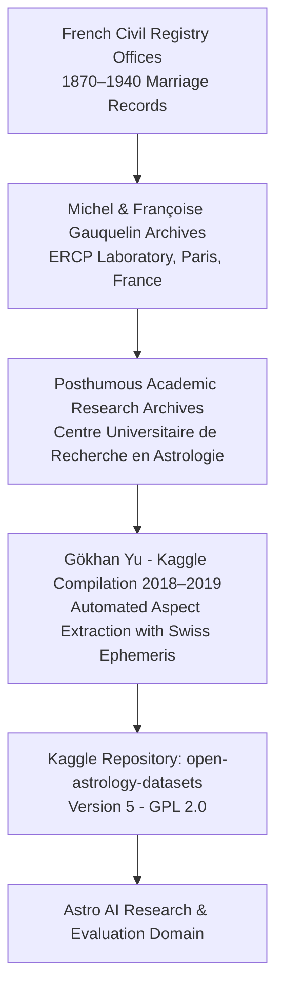

# Open Astrology Dataset: Provenance & Licensing Analysis

**Document Version:** 1.0.0  
**Target System:** Astro AI (Commercial Enterprise AI Astrology Platform)  
**Dataset Identifiers:** `gokhanyu/open-astrology-datasets` (Kaggle Dataset ID: 29206)

---

## 1. Dataset Origin & Provenance Chain

### Chain of Custody:
1. **Primary Historical Collection**: Michel Gauquelin (1928–1991) and Françoise Gauquelin compiled ~50,000 birth certificates from French civil registers to perform statistical tests on planetary positions and occupational/marital heredity.
2. **Digital Compilation**: In 2018–2019, researcher Gökhan Yu digitized and processed the couple subsets, computing inter-chart synastry aspect matrices (7-degree orbs) across 20,000 married pairs and paired them with randomized synthetic controls.
3. **Kaggle Distribution**: Uploaded to Kaggle under dataset ID `29206` with version 5 timestamped July 14, 2019.

---

## 2. Licensing Analysis (GPL-2.0 Copyleft)

The dataset explicitly declares **GPL 2.0** on Kaggle schema metadata:
* **License Type**: `GNU General Public License v2.0` (`GPL-2.0`)
* **URL**: `http://www.gnu.org/licenses/old-licenses/gpl-2.0.en.html`

### Commercial Legal Risk Assessment:

| Dimension | GPL-2.0 Requirement | Impact on Astro AI | Risk Rating |
| :--- | :--- | :--- | :--- |
| **Commercial Use** | Permitted with reciprocal source code disclosure of derivative works. | If dataset code/tables are bundled into proprietary backend binaries, copyleft obligations could be argued. | **HIGH RISK if bundled directly** |
| **Modification / Derivatives** | Derivatives must also be licensed under GPL-2.0. | Creating proprietary ML weights derived solely from this data creates copyleft ambiguity. | **HIGH RISK for fine-tuning** |
| **Internal Reference & Testing** | Internal non-distributed analysis and mock test fixtures do NOT trigger distribution copyleft. | Safe for unit test fixtures, schema normalizers, and internal research. | **SAFE for isolated test fixtures** |

> [!CAUTION]
> **Commercial Verdict**: `COMMERCIAL USE: UNVERIFIED / COPYLEFT RESTRICTED`.  
> We MUST NOT ship the raw 60,000-row CSV database inside the commercial backend package or store it in production MongoDB collections.

---

## 3. Privacy, PII & Regulatory Compliance

1. **Personally Identifiable Information (PII)**:
   * The dataset uses synthetic/anonymized identifiers (`Chart_A_Name`, `Chart_B_Name`) rather than citizen names.
   * Birth timestamps and coordinates are historical (pre-1940 French marriage registries).
   * **GDPR Compliance**: Deceased historical records over 80 years old fall outside GDPR scope under standard EU archival exemptions.

2. **Data Leakage & Target Contamination**:
   * The binary aspects are computed purely mathematically from ephemeris tables without target leakage.
   * However, because the positive and negative distributions are statistically indistinguishable, training a classifier on these columns produces random-guess performance (~50% accuracy), offering zero predictive utility.

---

## 4. Policy for Astro AI Production Code

1. **No Production Database Ingestion**: Do not load the full CSV into production Mongo/Postgres.
2. **No Prompt Embedding**: Do not inject synastry boolean vectors into LLM system prompts.
3. **Isolated Test Utilities**: We provide a strictly typed `dataset-normalizer.ts` and `dataset-validator.ts` in `backend/src/modules/compatibility/data/` for data science reproducibility and aspect validation with explicit provenance headers.
